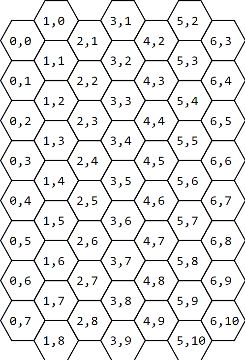

# Operation Cuckoo

This is an implementation of the board game [Operation Cuckoo](https://boardgamegeek.com/boardgame/367799/operation-cuckoo).

# Technical details

This is a Vue 3 workspace using Typescript and Vite.

## Coordinate

We have a hexagon grid, for which there are many different coordinate systems. In this project we use the [Axial coordinate system](https://www.redblobgames.com/grids/hexagons/#coordinates). For our board, it looks like this:

